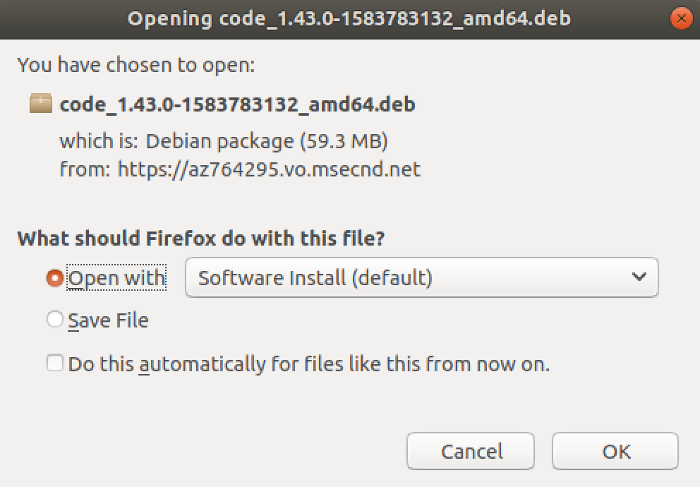
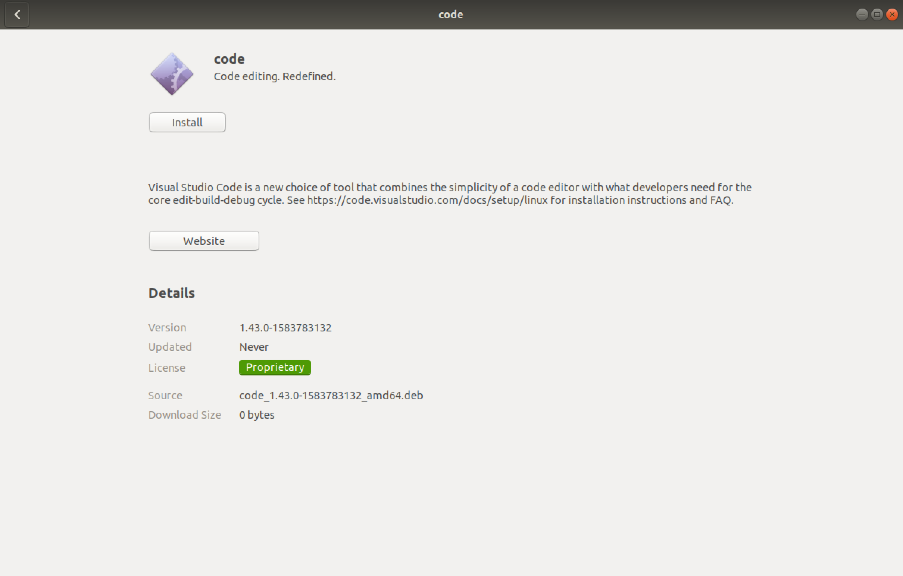
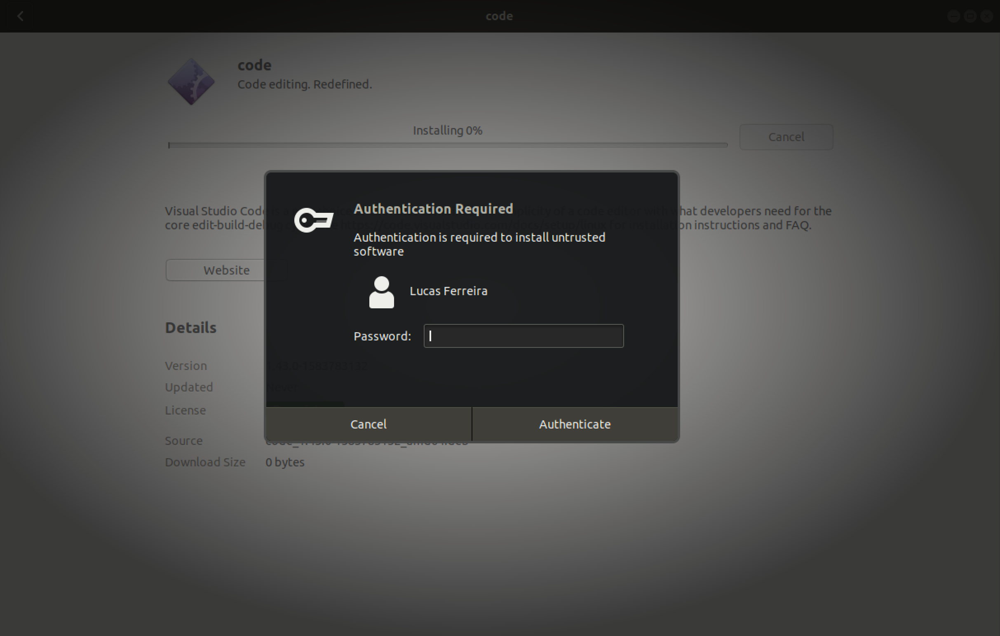
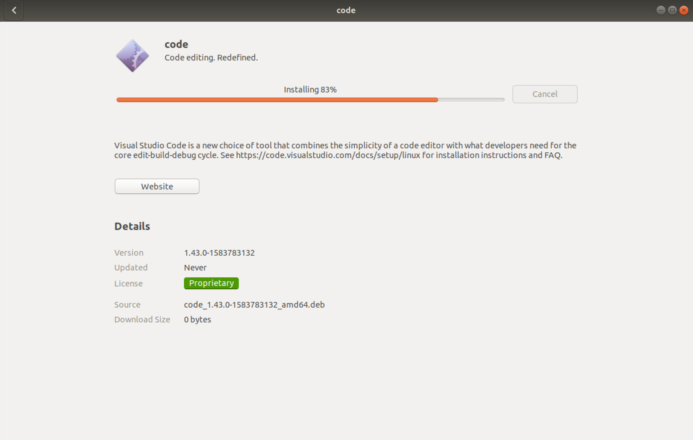
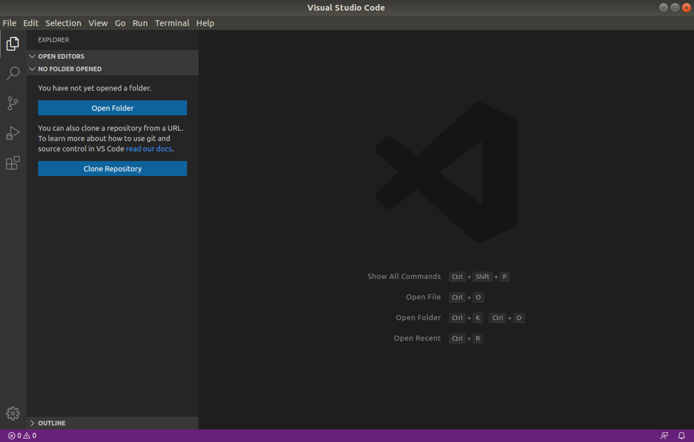

# Visual Studio Code

## Pré-Instalação

- Escolha a versão disponível para o seu dispositivo

  [Baixar VSCode](https://code.visualstudio.com)

## Instalação

1. Execute o arquivo **.deb** ou **.rpm**, conforme baixado;
2. Clique em <kbd>OK</kbd> para permitir a execução do software;

    

3. Em seguida, clique em <kbd>Install</kbd>;

    

4. Informe sua senha (caso solicitada) e clique em <kbd>Authenticate</kbd>;

    

5. Aguarde o término da instalação do Visual Studio Code;

    

6. Ao final da instalação, abra o aplicativo VS Code.

    