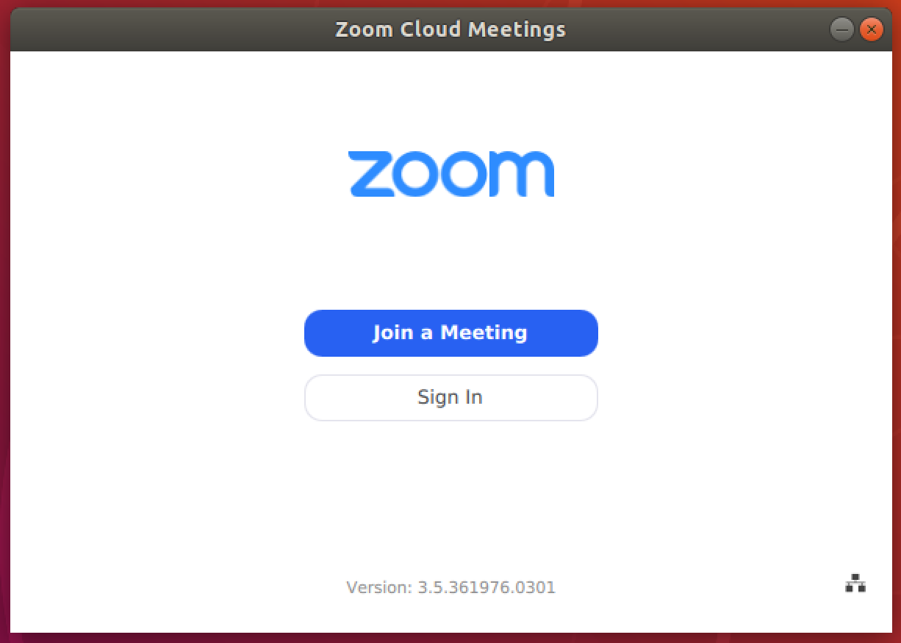

# Zoom

## Instalação

1. Acesse o link [https://zoom.us/download#client_4meeting](https://zoom.us/download#client_4meeting);
2. Baixe o __Cliente Zoom para Reuniões__;

    

3. Execute o arquivo __Zoom.deb__ baixado;

4. Clique em <kbd>Install</kbd> para instalar o Zoom;

    

5. Informe sua senha (caso solicitada) e clique em <kbd>Authenticate</kbd>;

    

6. Aguarde o término da instalação do Zoom;

    

7. Ao final da instalação, abra o aplicativo Zoom;

8. Clique em <kbd>Join a Meeting</kbd>;

    

9. Informe o ID da reunião e clique em <kbd>Join</kbd>;

    

10. Informe a senha da reunião e clique em <kbd>Join</kbd>;

    

11. Se a reunião não tiver iniciada, a seguinte tela aparecerá;

    

12. Assim que sua participação na reunião for aprovada, clique em <kbd>Join With Computer Audio</kbd>.

    