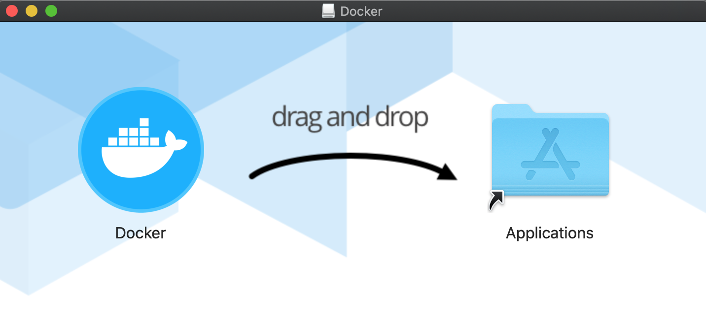
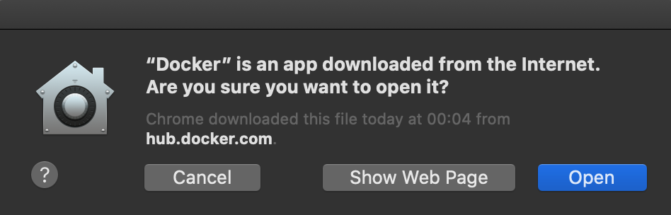
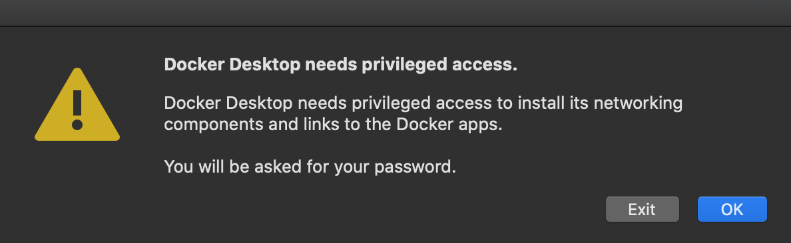
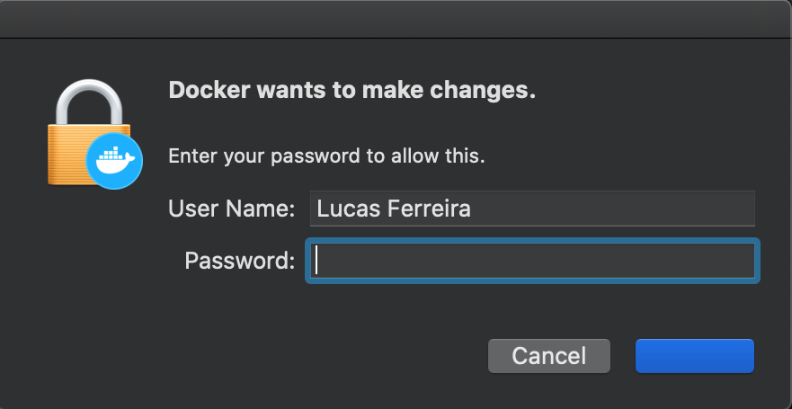
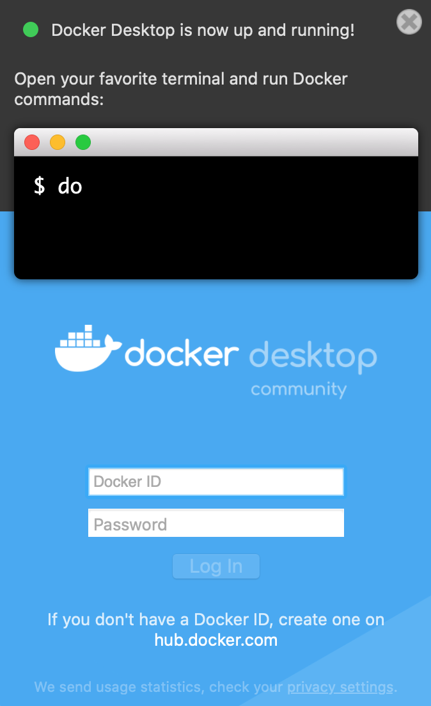

# Docker Desktop

O Docker Desktop para MacOS é a versão comunitária do Docker para Apple MacOS. Você pode baixar o Docker Desktop para MacOS no Docker Hub.

## Instalação

[Instruções para baixar e configurar do Docker Desktop](https://docs.docker.com/docker-for-mac/install/)

1. Execute o arquivo de instalação após baixá-lo;
2. Arraste o ícone do Docker para o diretório __Applications__;

    

3. Depois de instalado, execute o Docker e clique em <kbd>Open</kbd> para permitir sua execução;

    

4. Na nova janela, o Docker solicitará permissão para instalar componentes de rede, clique em <kbd>OK</kbd>;

    

5. Informe sua senha e clique no botão azul, que deveria conter <kbd>OK</kbd> (bug found!);

    

6. Uma notificação será exibida informando que o Docker está pronto para uso.

    

## Verificação

Para certificar-se de que o Docker está pronto para uso, execute o seguinte comando no terminal:

```bash
$ docker --version
```

Ele deve retornar a versão do Docker em execução, por exemplo:

```bash
Docker version 19.03.5, build 633a0ea
```