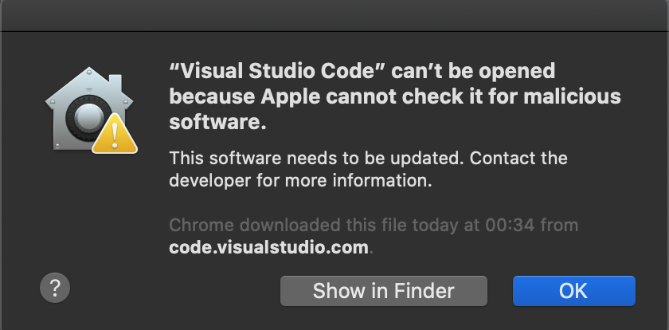
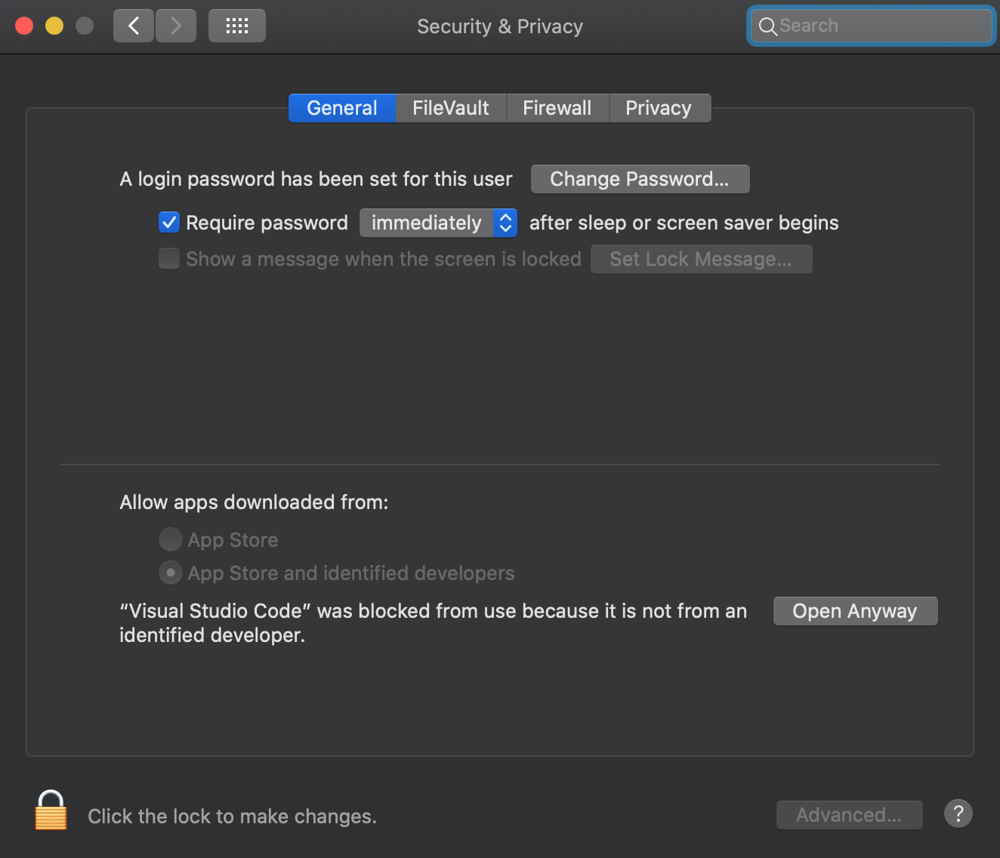
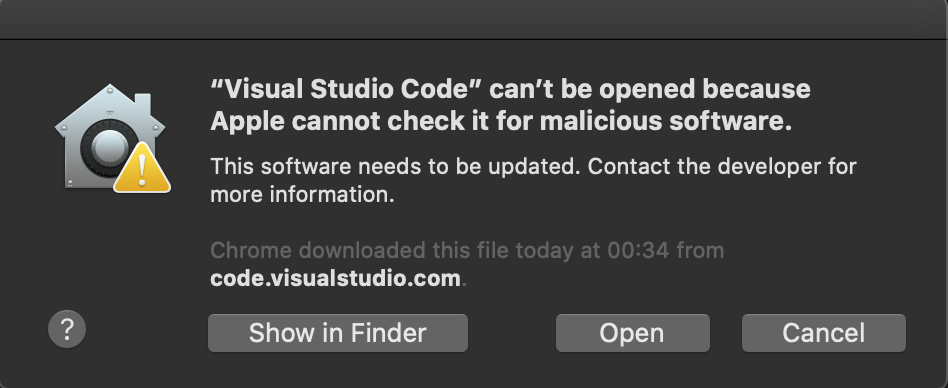
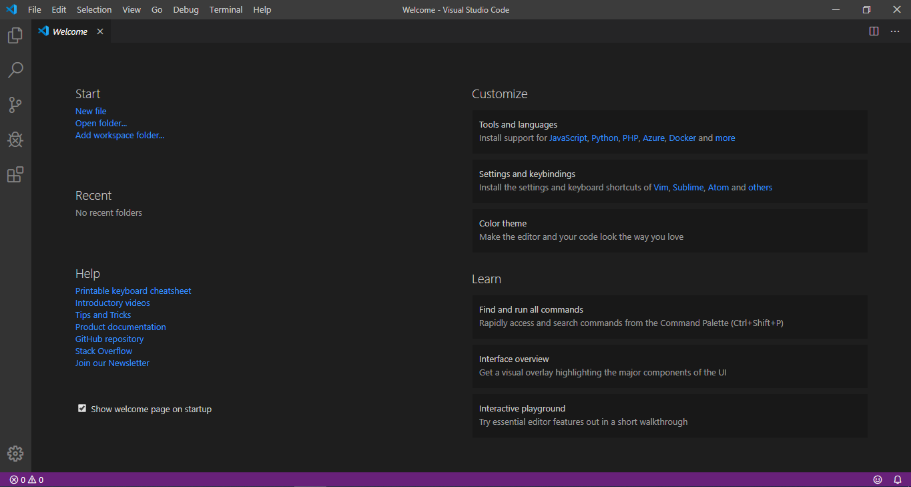

# Visual Studio Code

## Pré-Instalação

- Escolha a versão disponível para o seu dispositivo

  [Baixar VSCode](https://code.visualstudio.com)

## Instalação

1. Descompacte o arquivo de instalação;
2. Mova o executável __Visual Studio Code__ para __Applications__;
3. Em seguida, execute-o;
4. Ao executá-lo, você verá um aviso sobre software malicioso, isto porque o aplicativo não faz parte da Apple Store. Clique em <kbd>OK</kbd>;

    

5. Acesse as Configurações de Segurança e Privacidade;
6. Em __General__, clique em <kbd>Open Anyway</kbd>;

    

7. Mais uma vez você verá outro alerta, clique em <kbd>Open</kbd>;

    

8.  Em seguida, o VSCode será aberto.

    