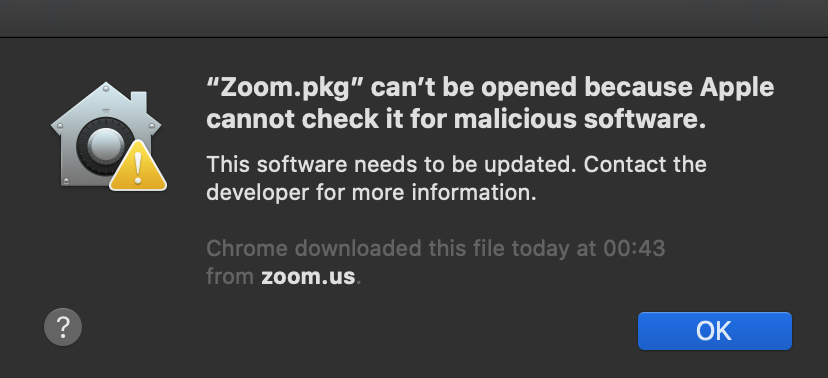
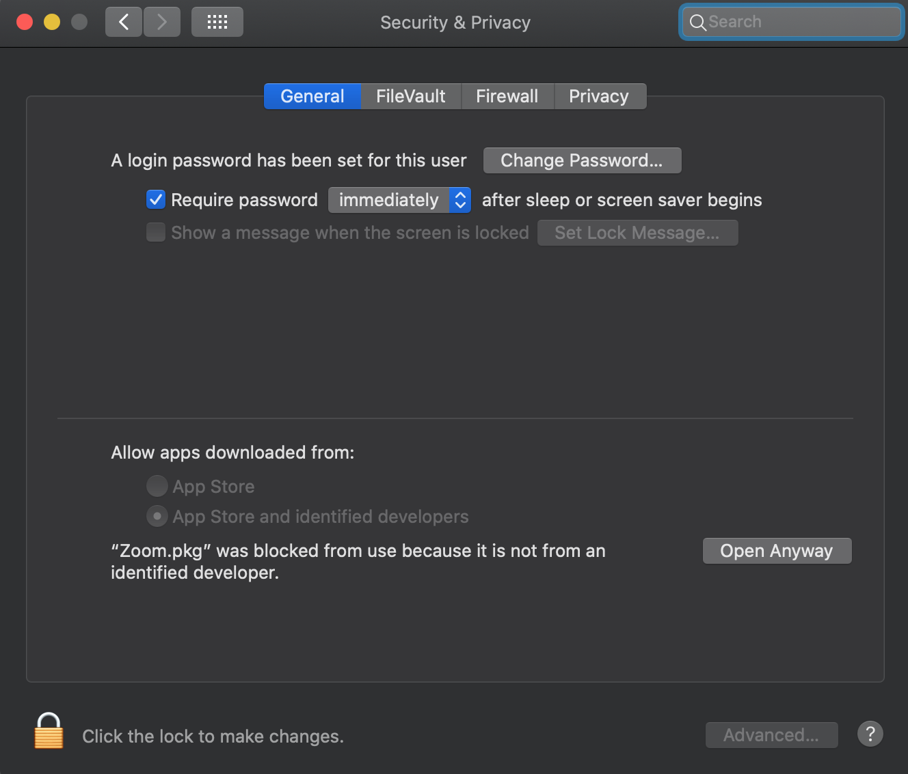
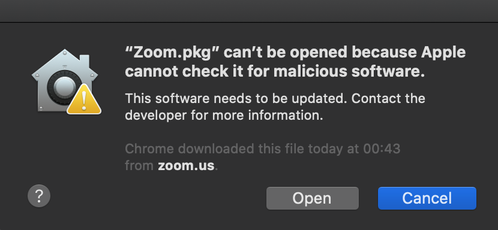
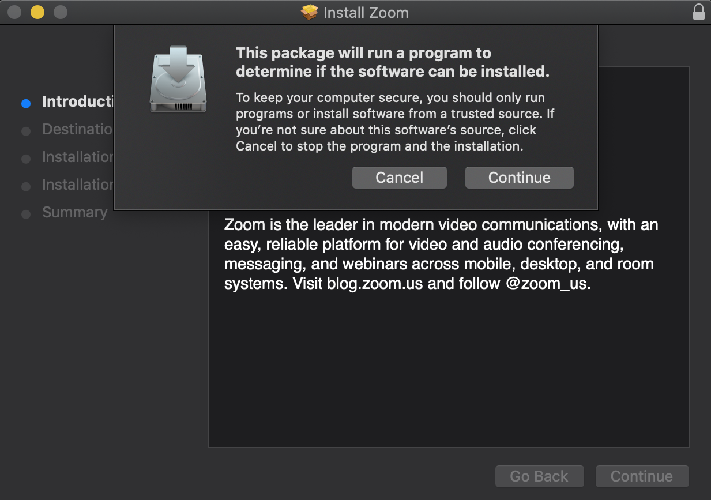
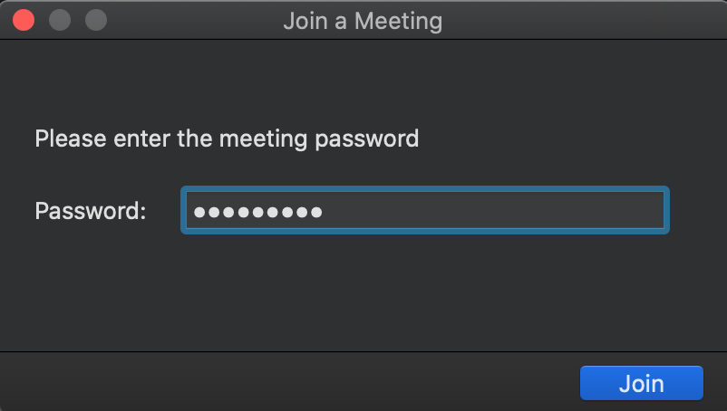
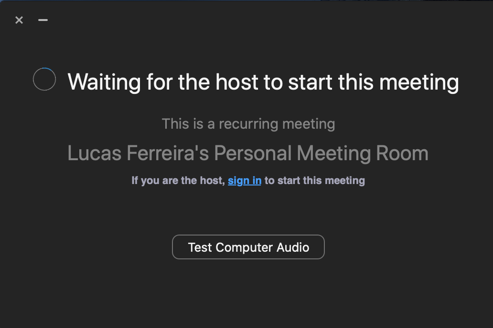
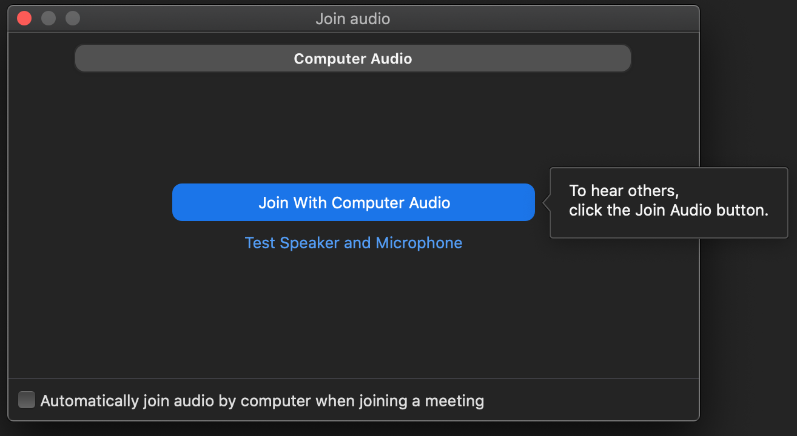

# Zoom

## Instalação

1. Acesse o link [https://zoom.us/download#client_4meeting](https://zoom.us/download#client_4meeting);
2. Baixe o __Cliente Zoom para Reuniões__;

    

3. Execute o arquivo __Zoom.pkg__ para extrair o aplicativo;
4. Ao executá-lo, você verá um aviso sobre software malicioso, isto porque o aplicativo não faz parte da Apple Store. Clique em <kbd>OK</kbd>;

    

5. Acesse as Configurações de Segurança e Privacidade;
6. Em __General__, clique em <kbd>Open Anyway</kbd>;

    

7. Mais uma vez você verá outro alerta, clique em <kbd>Open</kbd>;

    

8. Clique em <kbd>Continue</kbd> para instalar o Zoom;

    

9. Clique em <kbd>Join a Meeting</kbd>;

    

10. Informe o ID da reunião e clique em <kbd>Join</kbd>;

    

11. Informe a senha da reunião e clique em <kbd>Join</kbd>;

    

12. Se a reunião não tiver iniciado, a seguinte tela aparecerá;

    

13. Se a reunião tiver iniciado, a seguinte tela aparecerá. Logo, aguarde sua inclusão por mim na reunião;

    

14. Assim que sua participação na reunião seja aprovada, clique em <kbd>Join With Computer Audio</kbd>.

    