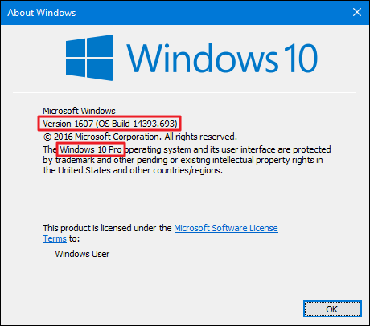

# Windows

## Criação de Contas

* GitHub:
  - Crie uma conta no [Github](https://github.com) caso ainda não a possua.
* Docker Hub
  - Crie uma conta no [Docker Hub](https://hub.docker.com) caso ainda não a possua.

## Ambiente de Desenvolvimento

### Visual Studio Code

* Baixe e Instale o editor [VS Code](https://code.visualstudio.com)
* Em seguida, instale as seguintes extensões no VS Code:
  * [Cucumber (Gherkin)](https://marketplace.visualstudio.com/items?itemName=alexkrechik.cucumberautocomplete)
  * [Docker](https://marketplace.visualstudio.com/items?itemName=ms-azuretools.vscode-docker)
  * [Gherkin Indent](https://marketplace.visualstudio.com/items?itemName=AravindKumar.gherkin-indent)
  * [Material Icon Theme](https://marketplace.visualstudio.com/items?itemName=PKief.material-icon-theme)
  * [Remote Development](https://marketplace.visualstudio.com/items?itemName=ms-vscode-remote.vscode-remote-extensionpack)
  * [RSpec Snippets](https://marketplace.visualstudio.com/items?itemName=karunamurti.rspec-snippets)
  * [Ruby](https://marketplace.visualstudio.com/items?itemName=rebornix.Ruby)
  * [Ruby Rubocop](https://marketplace.visualstudio.com/items?itemName=misogi.ruby-rubocop)
  * [Ruby Solargraph](https://marketplace.visualstudio.com/items?itemName=castwide.solargraph)
  * [View In Browser](https://marketplace.visualstudio.com/items?itemName=qinjia.view-in-browser)
  * [YAML](https://marketplace.visualstudio.com/items?itemName=redhat.vscode-yaml)

### Docker

Primeiro identifique a edição do seu sistema operacional, isto é, se ela é __Home__ ou __Pro__. Siga estes passos para identificar a edição do seu Sistema Operacional:

  - Abra a janela __Executar__ com o atalho <kbd>WINDOWS</kbd> + <kbd>R</kbd>
  - Digite _winver_ e clique em <kbd>OK</kbd>

  A imagem abaixo mostra onde você pode identificar a edição, neste caso é um __Windows 10 Pro__, mas poderia ser __Windows 10 Home__.

  

  ou use o atalho <kbd>WINDOWS</kbd> + <kbd>I</kbd>, clique em __Sistema__ > __Sobre__ e desça até a seção _Especificações do Windows_.

Qual é a sua edição, [Home](./home.md) ou [Pro](./pro.md)?