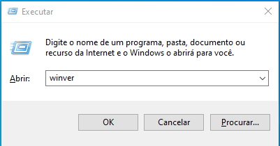
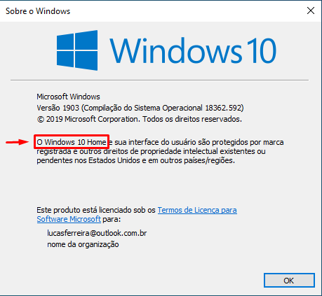
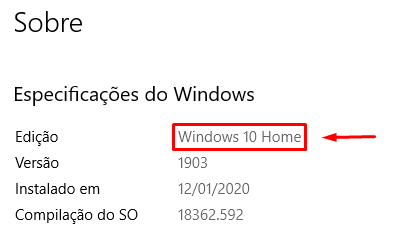

# Windows

## Identificar Edição do Sistema Operacional

Primeiro, siga estes passos para identificar a edição do seu Sistema Operacional, isto é, se ela é __Home__ ou __Pro__:

  - Abra a janela __Executar__ com o atalho <kbd>WINDOWS</kbd> + <kbd>R</kbd>
  - Digite _winver_ e clique em <kbd>OK</kbd>

  

  A imagem abaixo mostra onde você pode identificar a edição, neste caso é um __Windows 10 Pro__, mas poderia ser __Windows 10 Home__.

  <!--  -->
  

  ou use o atalho <kbd>WINDOWS</kbd> + <kbd>I</kbd>, clique em __Sistema__ > __Sobre__ e desça até a seção _Especificações do Windows_.

  