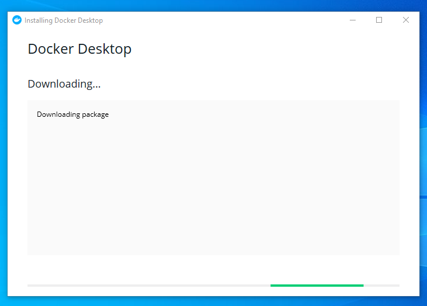
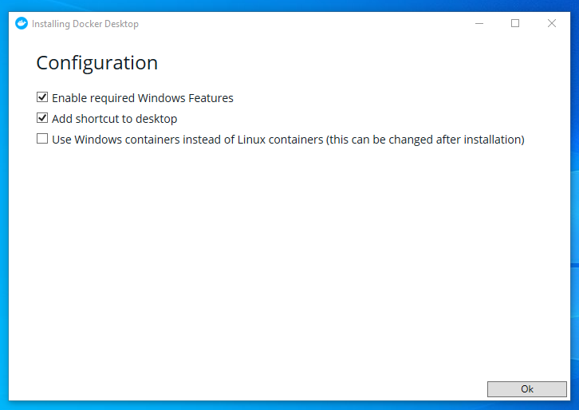
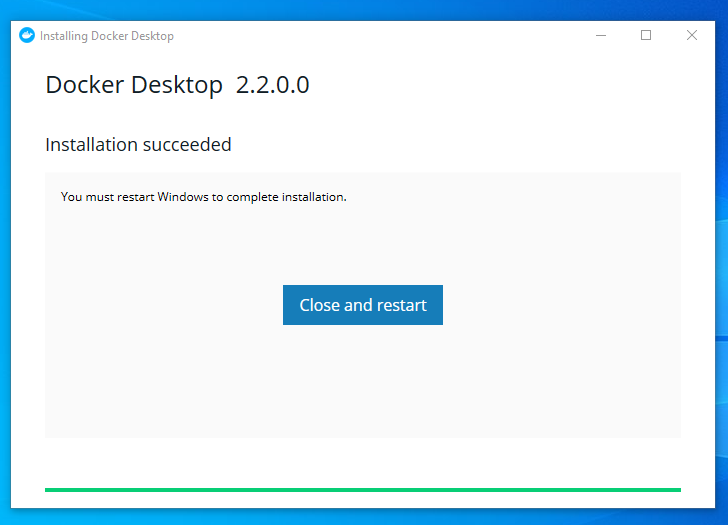
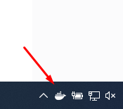
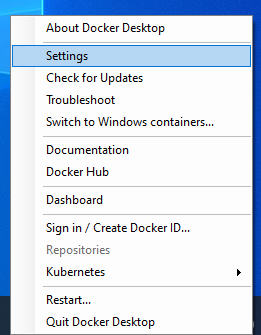
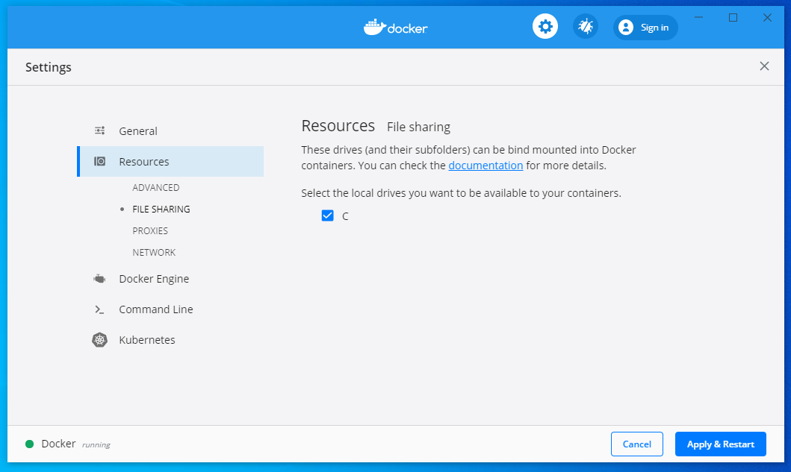

# Docker Desktop

O Docker Desktop para Windows é a versão comunitária do Docker para Microsoft Windows. Você pode baixar o Docker Desktop para Windows no Docker Hub.

## Pré-Instalação

- Ative o Hyper-V caso o seu dispositivo o possua e esteja desativado ([Instruções](../hyperv/README.md#ativar-hyper-v));
- A arquitetura do processador do dispositivo deve ser 64 bits;
- O dispositivo precisa de, no mínimo, 4 GB de memória RAM.

## Instalação

[Instruções para baixar e configurar o Docker Desktop](https://docs.docker.com/docker-for-windows/install/)

1. Execute o arquivo de instalação após baixá-lo;
2. Clique em <kbd>Sim</kbd> para permitir a execução do software;
3. Aguarde que o Docker baixe os pacotes necessários para continuar a instalação;

    

4. Em __Configuration__, clique em <kbd>Ok</kbd>;

    

5. Ao finalizar a instalação, clique em <kbd>Close and Restart</kbd>. Atenção: O Windows será reinicializado;

    

6. Uma notificação será exibida informando que o Docker está iniciando.

## Pós-Instalação

1. Depois de iniciado o Docker, acesse o menu suspenso clicando com o botão direito no ícone do Docker na área de notificações da barra de tarefas;

    

2. Em seguida, clique em __Settings__;

    

3. Selecione o menu __Resources__ > __File Sharing__ e selecione a unidade de disco __C__;

    

4. Em seguida, clique em <kbd>Apply and Restart</kbd>. O Docker será reinicializado;
5. Informe sua senha para permitir o compartilhamento de unidade de disco, caso solicitado.

## Verificação

Para certificar-se de que o Docker está pronto para uso, execute o seguinte comando no terminal:

```bash
$ docker --version
```

Ele deve retornar a versão do Docker em execução, por exemplo:

```bash
Docker version 19.03.5, build 633a0ea
```