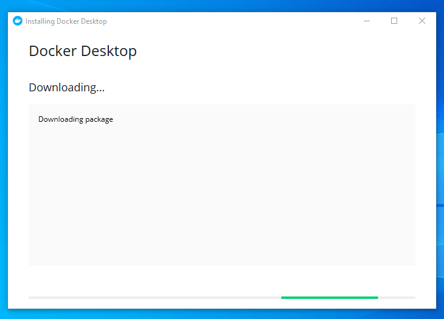
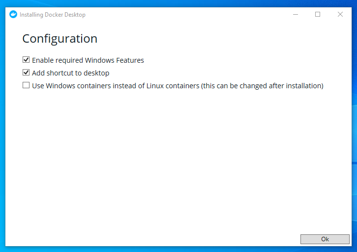
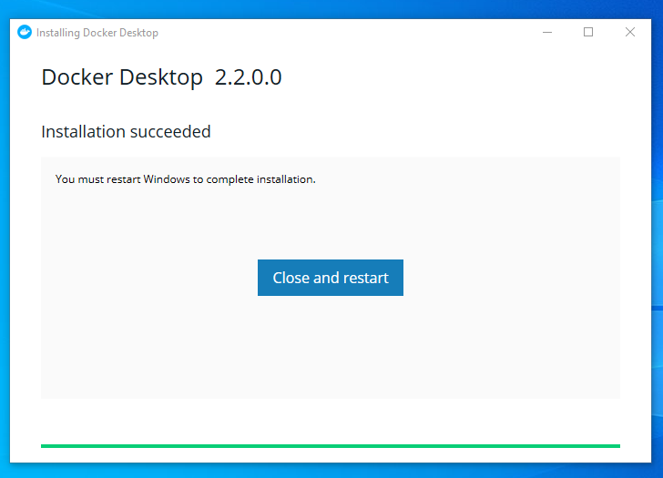
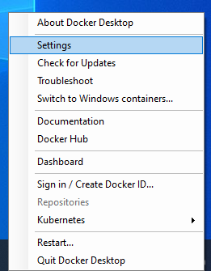

# Docker Desktop

O Docker Desktop para Windows é a versão comunitária do Docker para Microsoft Windows. Você pode baixar o Docker Desktop para Windows no Docker Hub.

## Pré-Instalação

- Ative o Hyper-V caso o seu dispositivo o possua e esteja desativado;
- A arquitetura do processador do dispositivo deve ser 64 bits;
- O dispositivo precisa de, no mínimo, 4 GB de memória RAM.

## Instalação

[Instruções para baixar e configurar do Docker Desktop](https://docs.docker.com/docker-for-windows/install/)

1. Execute o arquivo de instalação após baixá-lo;
2. Clique em <kbd>Sim</kbd> para permitir a execução do software;
3. Aguarde que o Docker baixe os pacotes necessários para continuar a instalação;

    

4. Em __Configurações__, clique em <kbd>Ok</kbd>;

    

5. Ao finalizar a instalação, clique em <kbd>Fechar e Sair</kbd> (<kbd>Close and log out</kbd>);

    

6. Uma notificação será exibida informando que o Docker está iniciando.


## Pós-Instalação

1. Depois de iniciado o Docker, acesse suas configurações;

    

    

2. Selecione o menu __Shared Drives__ e selecione a unidade de disco __C__;

    

3. Em seguida, clique em <kbd>Aplicar e Reiniciar</kbd> (<kbd>Apply and Restart</kbd>);
4. Informe sua senha para permitir o compartilhamento de unidade de disco, caso solicitado;
5. Para concluir, clique em <kbd>OK</kbd>.

## Verificação

Para certificar-se de que o Docker está pronto para uso, execute o seguinte comando no terminal:

```bash
$ docker --version
```

Ele deve retornar a versão do Docker em execução, por exemplo:

```bash
Docker version 19.03.5, build 633a0ea
```