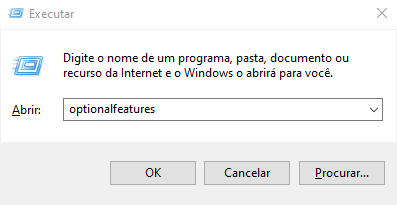
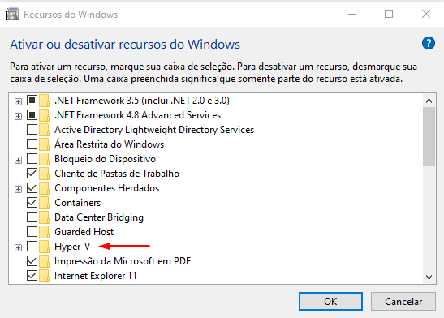
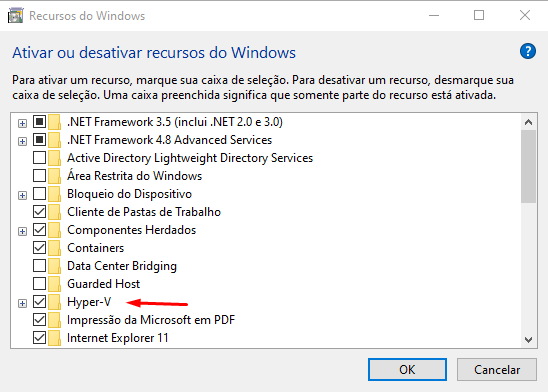

# Windows

## Ativar Hyper-V

1. Abra a janela __Executar__ com o atalho <kbd>WINDOWS</kbd> + <kbd>R</kbd>
2. Digite _optionalfeatures_ e clique em <kbd>OK</kbd>

    

3. Quando a janela __Recursos do Windows__ (Windows Features) abrir, procure por Hyper-V e marque a caixa de seleção.

    

4. Clique em <kbd>OK</kbd> para aplicar a alteração.

## Desativar Hyper-V

1. Abra a janela __Executar__ com o atalho <kbd>WINDOWS</kbd> + <kbd>R</kbd>
2. Digite _optionalfeatures_ e clique em <kbd>OK</kbd>

    

3. Quando a janela __Recursos do Windows__ (Windows Features) abrir, procure por Hyper-V e desmarque a caixa de seleção.

    

4. Clique em <kbd>OK</kbd> para aplicar a alteração.
