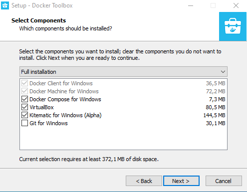

# Docker Toolbox

O Docker Toolbox fornece uma maneira de usar o Docker em sistemas Windows que não atendem aos requisitos mínimos do sistema para o aplicativo Docker Desktop.

## Pré-Instalação

- Desative o Hyper-V caso o seu dispositivo o possua. ([Instruções](../hyperv/README.md#desativar-hyper-v))

## Instalação

[Instruções para baixar e configurar do Docker Toolbox](https://docs.docker.com/v17.12/toolbox/toolbox_install_windows/)

1. Execute o arquivo de instalação após baixá-lo;
2. Clique em <kbd>Sim</kbd> para permitir a execução do software;
3. Quando o instalador abrir, clique em <kbd>Next</kbd>;

    

4. Em __Select Components__, clique em <kbd>Next</kbd>;

    

5. Em __Select Additional Tasks__, clique em <kbd>Next</kbd>;

    

6. Em __Ready to Install__, clique em <kbd>Install</kbd>;

    

7. Clique em <kbd>Instalar</kbd> quando aparecer a janela de instalação do Oracle Corporation;

    

8. Pronto, clique em <kbd>Finish</kbd> para concluir.

    

## Pós-Instalação

1. Execute o atalho localizado na área de trabalho chamado __Docker Quickstart Terminal__;
2. Uma janela de terminal será aberta e as dependências serão baixadas;
3. O sistema solicitará permissões para o VirtualBox, aprove todas;
4. Ao final, uma VM do Virtualbox estará rodando o Docker.

    

## Verificação

Para certificar-se de que o Docker está pronto para uso, execute o seguinte comando no terminal:

```bash
$ docker --version
```

Ele deve retornar a versão do Docker em execução, por exemplo:

```bash
Docker version 18.03.0-ce, build 0520e24302
```
