# Git for Windows

O Git é um sistema de controle de versão distribuído de código aberto e gratuito, projetado para lidar com tudo, desde projetos pequenos a grandes, com velocidade e eficiência.

## Pré-Instalação

- Escolha a versão do Git conforme a arquitetura do seu dispositivo, isto é, 32 ou 64 bits.

  [Baixar Git for Windows](https://git-scm.com/download/win)

## Instalação

1. Execute o arquivo de instalação após baixá-lo;
2. Clique em <kbd>Sim</kbd> para permitir a execução do software;
3. Em __Information__, clique em <kbd>Next</kbd>;

    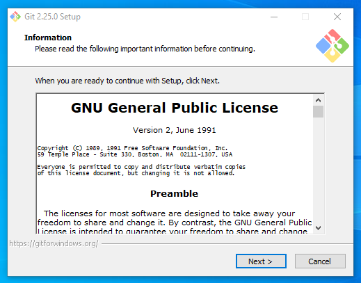

4. Em __Select Destination Location__, clique em <kbd>Next</kbd>;

    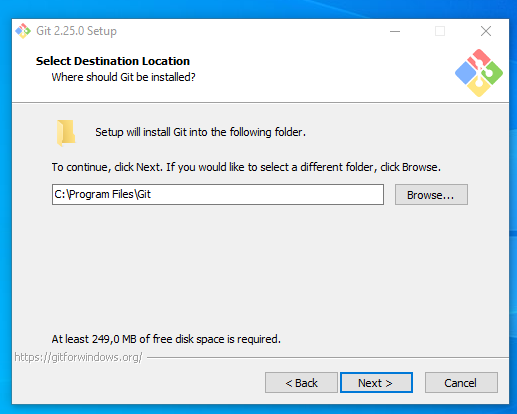

5. Em __Select Components__, clique em <kbd>Next</kbd>;

    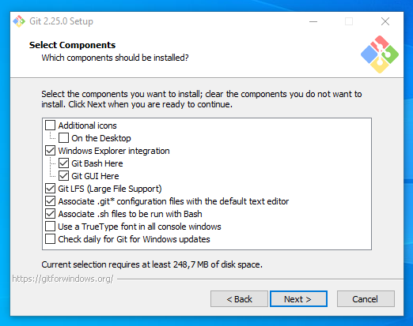

6. Em __Select Start Menu Folder__, clique em <kbd>Next</kbd>;

    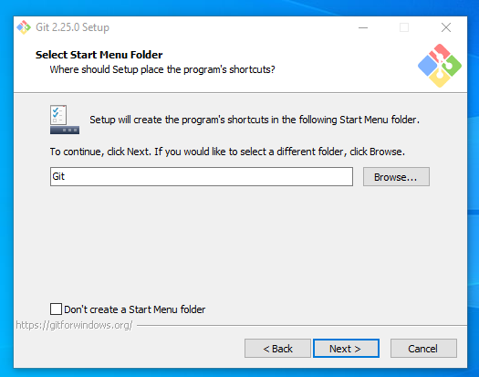

7. Em __Choosing the default editor used by Git__, selecione _Use Visual Studio Code as Git's default editor_ e clique em <kbd>Next</kbd>;

    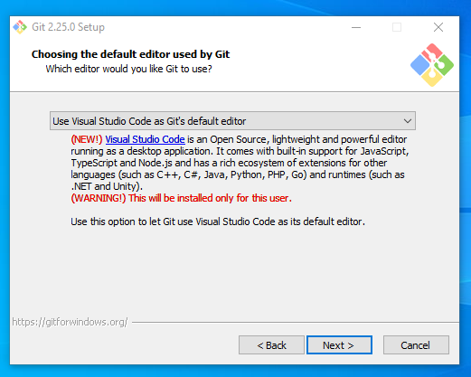

8. Em __Adjusting your PATH environment__, clique em <kbd>Next</kbd>;

    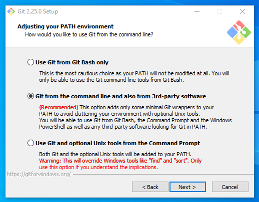

9. Em __Choosing HTTPS transport backend__, clique em <kbd>Next</kbd>;

    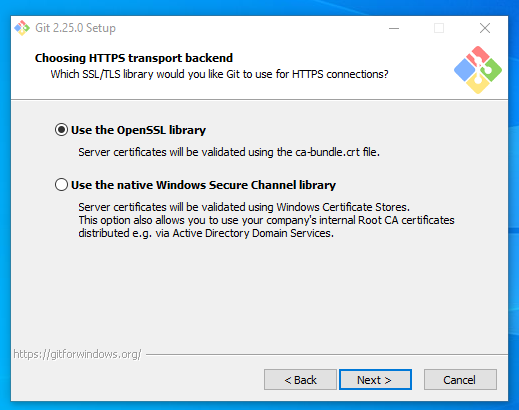

10. Em __Configuring the line ending conversions__, clique em <kbd>Next</kbd>;

    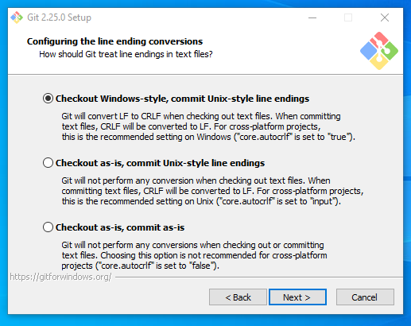

11. Em __Configuring the terminal emulator to use with Git Bash__, clique em <kbd>Next</kbd>;

    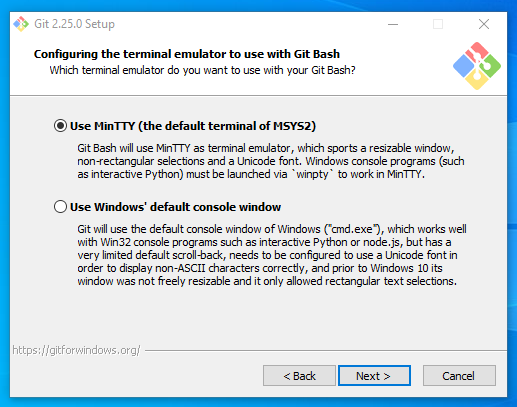

12. Em __Configuring extra options__, clique em <kbd>Next</kbd>;

    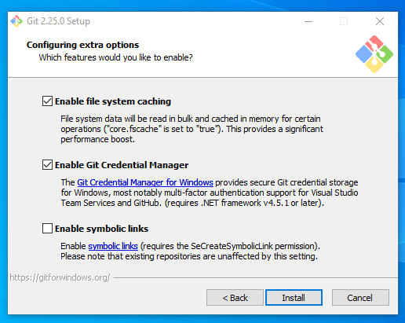

13. Aguarde a conclusão da instalação do Git;

    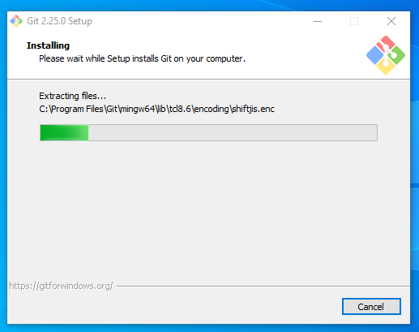

14. Para finalizar, desmarque a opção __View Release Notes__ e clique em <kbd>Next</kbd>.

    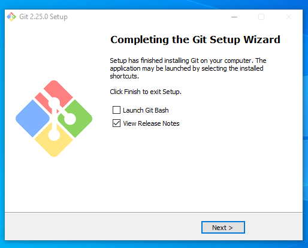