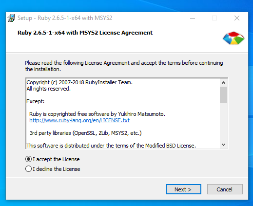
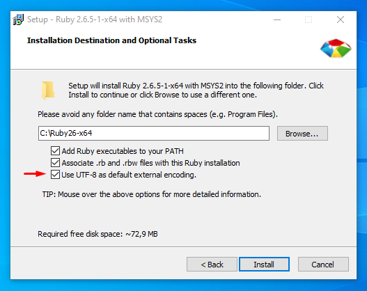
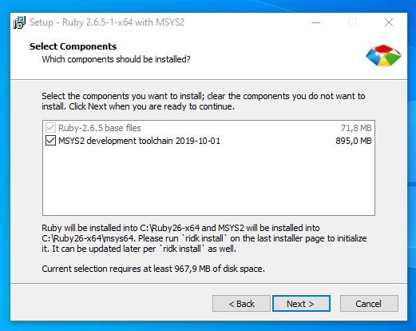
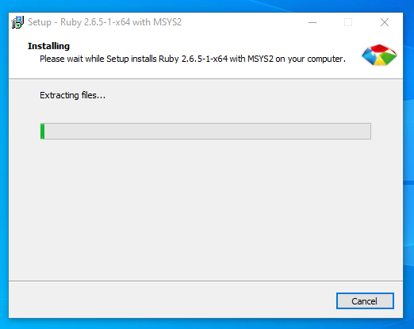
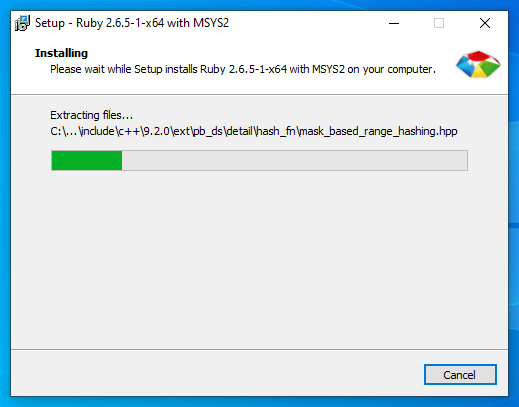
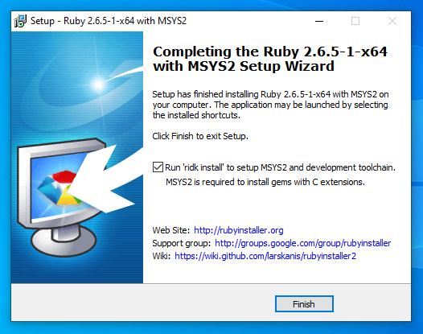
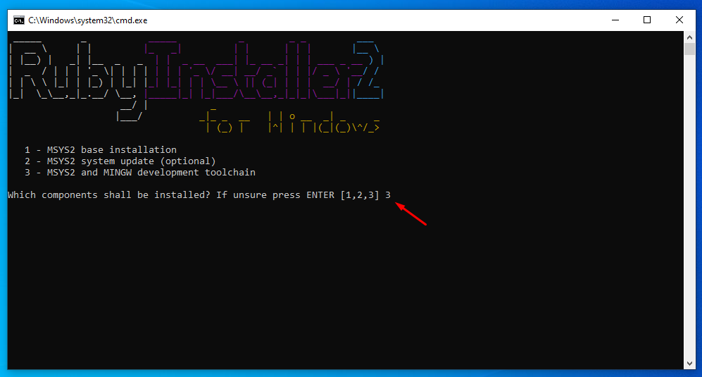
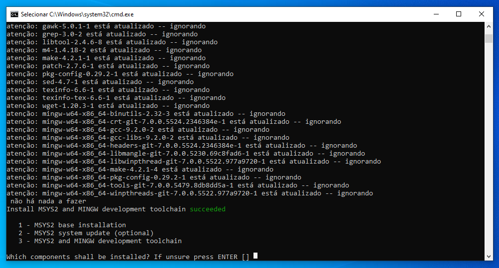

# Ruby

## Pré-Instalação

- Escolha a versão ruby que contiver a seta (=>) na seção DevKit.

  [Baixar Ruby](https://rubyinstaller.org/downloads/)

## Instalação

1. Execute o arquivo de instalação após baixá-lo;
2. Clique em <kbd>Sim</kbd> para permitir a execução do software;
3. Selecione a opção _I accept the License_ e clique em <kbd>Next</kbd>;

    

4. Em __Installation Destination and Optional Tasks__, marque a opção _Use UTF-8 as default external encoding_ e clique em <kbd>Next</kbd>;

    

5. Em __Select Components__, clique em <kbd>Next</kbd>;

    

6. Aguarde a extração dos arquivos e a instalação do Ruby concluir;

    

    

7. Clique em <kbd>Finish</kbd>;

    

8. Quando o CMD do RubyInstaller2 abrir, digite o número __3__ e dê <kbd>Enter</kbd>;

    

9. Aguarde a instalação dos componentes e dê <kbd>Enter</kbd> novamente para finalizar.

    

## Verificação

Para certificar-se de que o Ruby está pronto para uso, execute o seguinte comando no terminal:

```bash
$ ruby --version
```

Ele deve retornar a versão do Ruby em execução, por exemplo:

```bash
ruby 2.6.5p114 (2019-10-01 revision 67812) [x64-mingw32]
```