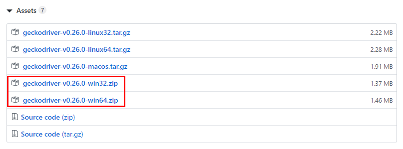

# Selenium WebDrivers

O Selenium WebDriver comanda um navegador nativamente, como faria um usuário real, localmente ou em máquinas remotas.

## ChromeDriver

### Pré-Instalação

1. Acesse o link [https://sites.google.com/a/chromium.org/chromedriver/downloads](https://sites.google.com/a/chromium.org/chromedriver/downloads);
2. Baixe a versão do ChromeDriver correspondente à versão do Google Chrome instalada no seu dispositivo.

    > Para saber a versão do Google Chrome do seu dispositivo, acesse: __Menu__ (3 pontos na vertical) > __Ajuda__ > __Sobre o Chrome__.

    

### Instalação

1. Extraia o arquivo __chromedriver.zip__;
2. Mova o arquivo __chromedriver.exe__ para o diretório __C:\Windows__.

### Pós-Instalação

1. Abra um terminal (CMD);
2. Verifique se o ChromeDriver foi instalado corretamente com o seguinte comando:

    ```bash
    $ chromedriver --version
    ```

    ```text
    ChromeDriver 79.0.3945.36 (3582db32b33893869b8c1339e8f4d9ed1816f143-refs/branch-heads/3945@{#614})
    ```

## GeckoDriver

### Pré-Instalação

1. Acesse o link [https://github.com/mozilla/geckodriver/releases](https://github.com/mozilla/geckodriver/releases);
2. Baixe a versão mais recente do GeckoDriver conforme a arquitetura do Mozilla Firefox instalada no seu dispositivo, isto é, se é 32 ou 64 bits.

    > Para saber a arquitetura do Mozilla Firefox do seu dispositivo, acesse: __Menu__ (3 traços na horizontal) > __Ajuda__ > __Sobre o Firefox__.

    

    > Escolha a versão do GeckoDriver

    

### Instalação

1. Extraia o arquivo __geckodriver-\<version\>-\<system\>.zip__;
2. Mova o arquivo __geckodriver.exe__ para o diretório __C:\Windows__.

### Pós-Instalação

1. Abra um terminal (CMD);
2. Verifique se o GeckoDriver foi instalado corretamente com o seguinte comando:

    ```bash
    $ geckodriver --version
    ```

    ```text
    geckodriver 0.26.0 (e9783a644016 2019-10-10 13:38 +0000)
    ```