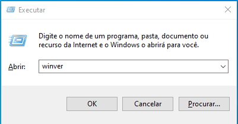
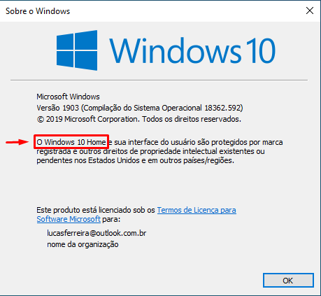
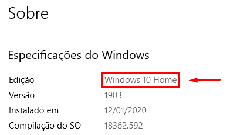

# Windows

## Identificar Edição do Sistema Operacional

Primeiro, siga estes passos para identificar a edição do seu Sistema Operacional, isto é, se ela é __Home__, __Pro__, __Enterprise__ ou __Education__:

1. Abra a janela __Executar__ com o atalho <kbd>WINDOWS</kbd> + <kbd>R</kbd>
2. Digite _winver_ e clique em <kbd>OK</kbd>

    

3. A imagem abaixo mostra onde você pode identificar a edição, neste caso é um __Windows 10 Home__, mas poderia ser __Windows 10 Pro__, __Windows 10 Enterprise__ ou __Windows 10 Education__.

    

    ou use o atalho <kbd>WINDOWS</kbd> + <kbd>I</kbd>, clique em __Sistema__ > __Sobre__ e desça até a seção _Especificações do Windows_.

    

    ou use o atalho <kbd>WINDOWS</kbd> + <kbd>FN</kbd> + <kbd>Pause Break</kbd> para abrir a janela de informações básicas do computador.

    