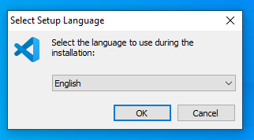
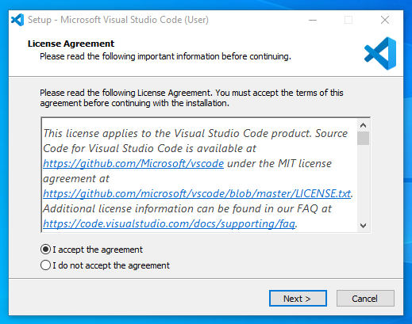
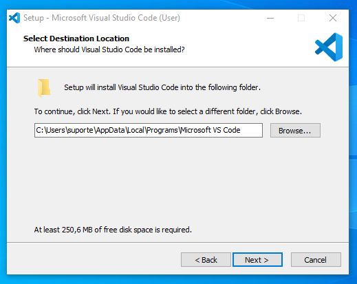
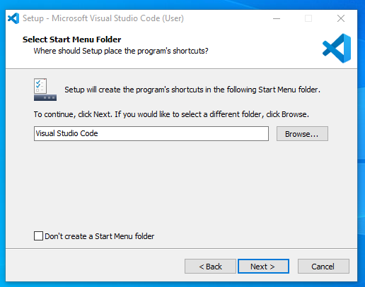
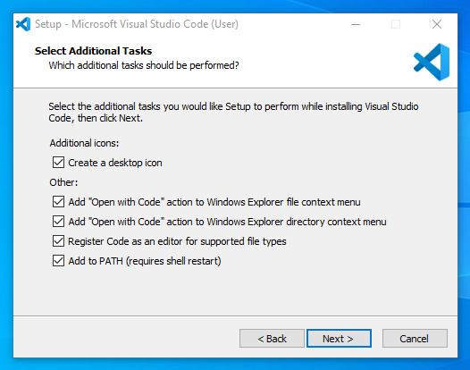
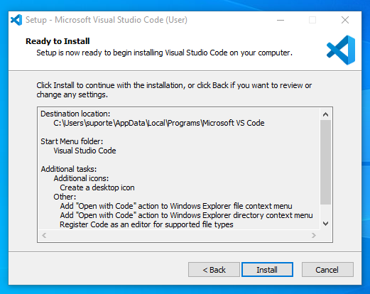
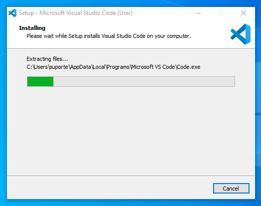
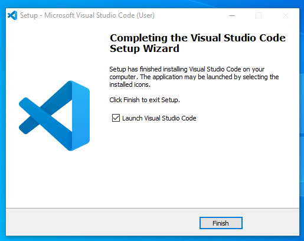

# Visual Studio Code

## Pré-Instalação

- Escolha a versão disponível para o seu dispositivo

  [Baixar VSCode](https://code.visualstudio.com)

## Instalação

1. Execute o arquivo de instalação após baixá-lo;
2. Clique em <kbd>Sim</kbd> para permitir a execução do software;
3. Em __Select Setup Language__, selecione a sua língua preferida e clique em <kbd>Next</kbd>;

    

4. Em __License Agreement__, selecione a opção _I accept the agreement_ e clique em <kbd>Next</kbd>;

    

5. Em __Select Destination Location__, clique em <kbd>Next</kbd>;

    

6. Em __Select Start Menu Folder__, clique em <kbd>Next</kbd>;

    

7. Em __Select Additional Tasks__, marque todas as opções e clique em <kbd>Next</kbd>;

    

8. Em __Ready to Install__, clique em <kbd>Install</kbd>;

    

9. Aguarde a instalação do editor;

    

10. Para finalizar, clique em <kbd>Finish</kbd>;

    

11. Em seguida, o VSCode será aberto.

    