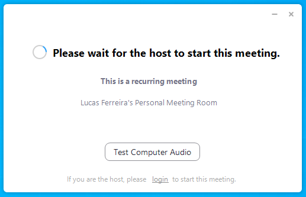
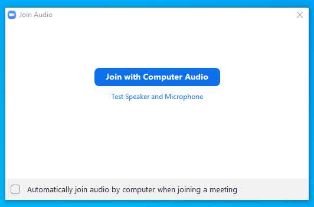

# Zoom

## Instalação

1. Acesse o link [https://zoom.us/download#client_4meeting](https://zoom.us/download#client_4meeting);
2. Baixe o __Cliente Zoom para Reuniões__;

    

3. Execute o arquivo __ZoomInstaller.exe__;
4. Em seguida, clique em <kbd>Join a Meeting</kbd>;

    

5. Informe o ID da reunião e clique em <kbd>Join</kbd>;

    

6. Informe a senha da reunião e clique em <kbd>Join Meeting</kbd>;

    

7. Se a reunião não tiver iniciado, a seguinte tela aparecerá;

    

8. Se a reunião tiver iniciado, a seguinte tela aparecerá. Logo, aguarde sua inclusão por mim na reunião;

    

9. Assim que sua participação na reunião for aprovada, clique em <kbd>Join with Computer Audio</kbd>.

    